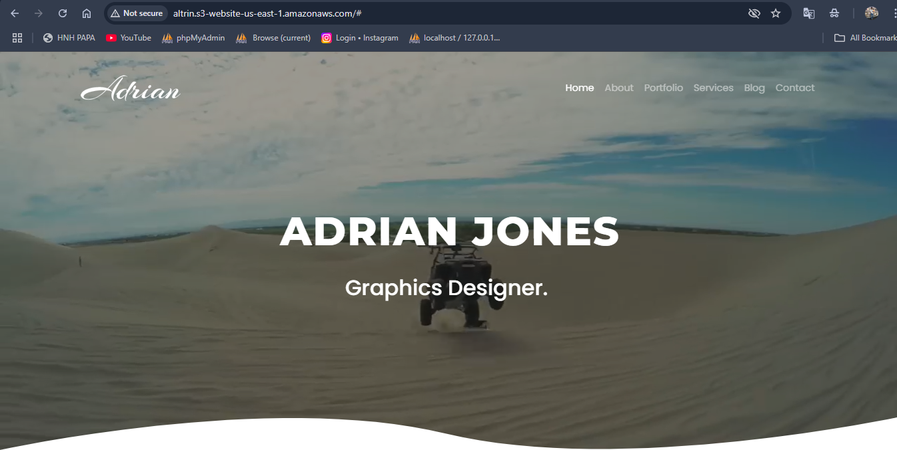

# 🌐 Scalable Static Website with S3 + Cloudflare + GitHub Actions

## 🚀 Objective
This project demonstrates how to deploy and host a static website using **AWS S3** (Free Tier) and **Cloudflare** CDN with **GitHub Actions** automating deployments on every commit.

## 🧰 Tech Stack
- **AWS S3** – For hosting the static site
- **Cloudflare** – For DNS, global CDN, and HTTPS
- **GitHub Actions** – CI/CD pipeline to deploy on push
- **HTML/CSS** – Static website content
- **Bash** – Used in automation (optional)


## 🔧 Setup Instructions

### Phase 1: Create and Push Website
1. Clone this repo or start a new one.
2. Add your static HTML/CSS files.
3. Push to the `main` branch.

### Phase 2: Set Up AWS S3 Bucket
1. Create a public S3 bucket named `altrin`.
2. Enable static website hosting.
3. Note the endpoint URL (e.g., `http://altrin.s3-website-us-east-1.amazonaws.com`).

### Phase 3: Configure GitHub Actions
1. Create **GitHub Secrets**:
   - `AWS_ACCESS_KEY_ID`
   - `AWS_SECRET_ACCESS_KEY`
2. Create `.github/workflows/deploy.yml`:
```yaml
name: Deploy to S3

on:
  push:
    branches: [main]

jobs:
  deploy:
    runs-on: ubuntu-latest
    steps:
      - name: Checkout Code
        uses: actions/checkout@v3

      - name: Sync to S3
        uses: jakejarvis/s3-sync-action@master
        with:
          args: --acl public-read --delete
        env:
          AWS_S3_BUCKET: altrin
          AWS_ACCESS_KEY_ID: ${{ secrets.AWS_ACCESS_KEY_ID }}
          AWS_SECRET_ACCESS_KEY: ${{ secrets.AWS_SECRET_ACCESS_KEY }}
          AWS_REGION: us-east-1
```
### Phase 4: Connect to Cloudflare
1. Add your custom domain to Cloudflare and point it to the S3 static site using CNAME.
2. Enable Flexible SSL, Auto Minify, and Browser Cache TTL.
3. Force HTTPS via page rules.


## 📸 Screenshot



---

## 🙌 Author

[Altrin Jabist](https://github.com/AltrinJabist)
